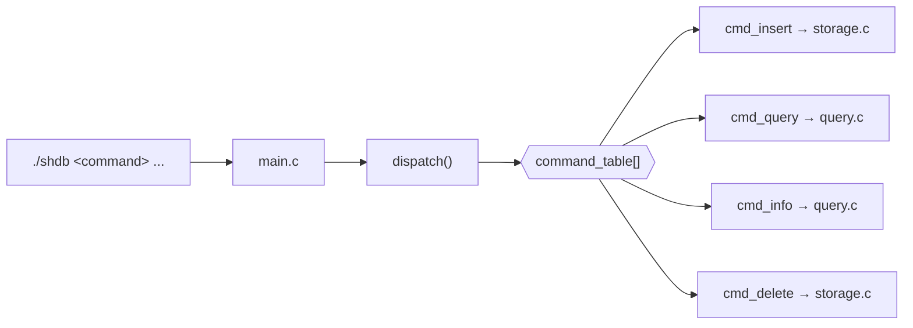
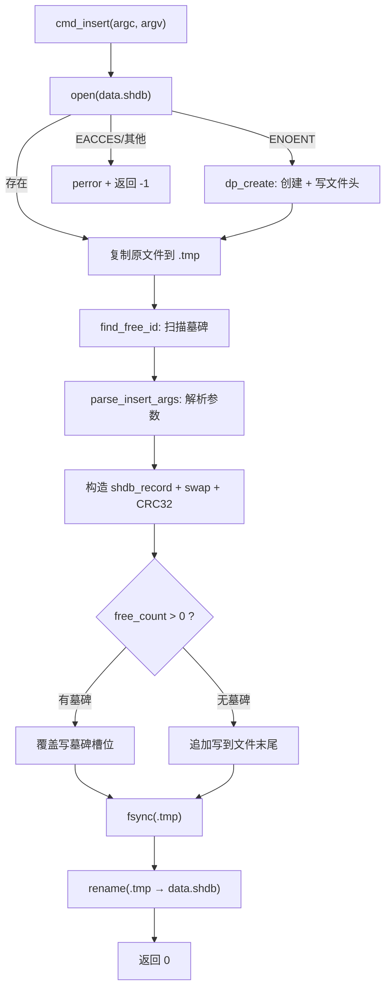
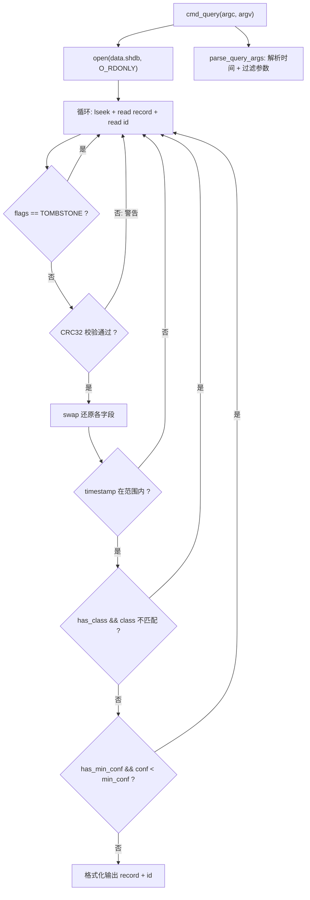

# shdb 设计与实现笔记

> **项目**：shdb — 嵌入式时序数据库  
> **进度**：Lv1 ✅ / Lv2 ✅ / Lv3 ⬜ / Lv4 ⬜ / Lv5 ⬜  
> **代码量**：~1050 行 C · 7 个源文件 · 1 个头文件  
> **运行方式**：CLI 直接模式（`./shdb <command> ...`）  

---

## 一、项目动机

时序数据库，是数据管理上很全面的一种项目，增删改查、排序面面俱到，同时也更具备实用性。相比于功能强大的工业时序数据库，在只具备 Linux 系统编程的基础时，我们退而求其次，针对我所期望的项目，开发一个更具针对性、功能更简洁、性能上限更贴合个人需求的学习性项目——shdb 时序数据库。

shdb 取"时序"的拼音首字母 `sh`，加上 `db`（database），与前置项目 `fdb`（file database）保持统一的命名风格。

### 分级路线

| 等级 | 目标 | 核心新增 | 运行方式 |
|:--:|------|------|------|
| **Lv1** ✅ | 存进去、查出来 | 文件头 + 定长记录 + append 写入 + 线性扫描 | CLI 直接模式 |
| **Lv2** ✅ | 崩溃不丢数据 | 原子写入 + tombstone + 空闲链表 + CRC32 + errno 全覆盖 | CLI 直接模式 |
| **Lv3** | 查得快 | .idx 时间戳索引 + mmap 二分查找 + 批量缓冲 + compact | CLI 直接模式 |
| **Lv4** | 后台服务 | shdbd 守护进程 + FIFO + 信号 + 并发安全 | 守护进程模式 |
| **Lv5** | 聚合完备 | 聚合统计 + 文档 + 测试 + 性能对比 | 双模式 |

其 Lv1 和 Lv2 实现了能存能查能删且不丢数据，更高阶的 Lv3 实现速查，Lv4 实现后台服务，Lv5 则聚合完备。目前，我完成的是 Lv1 和 Lv2 的开发。

---

## 二、整体架构设计

### 磁盘格式

数据储存在磁盘上一个名为 `data.shdb` 的二进制文件中。文件以头文件 + 记录的形式存在，每一条记录由 record + id 的形式构成。由此确定了三大数据结构：文件头结构体、记录结构体、id 结构体。

```
data.shdb 磁盘布局
┌────────────┬──────────────────┬─────────┬──────────────────┬─────────┬─────┐
│ file_header│ detect_record[0] │ id[0]   │ detect_record[1] │ id[1]   │ ... │
│  16 字节   │    36 字节       │ 4 字节  │    36 字节       │ 4 字节  │     │
└────────────┴──────────────────┴─────────┴──────────────────┴─────────┴─────┘
```

### 模块划分

我们需要写入、读取两大类型的操作，因此设定了 storage 和 query 两大文件——前者涉及"修改并存入磁盘"类型的操作，后者涉及"从磁盘中获取信息并按格式查看"的操作。不单单是读写，具备了更多拓展性。

整体使用采用 CLI 指令的形式。对于指令，有解析步骤，parser 文件对应这一步。

最后，需要一个共同的头文件 shdb.h，用来做文件之间彼此交流的接口，用来声明公用的函数，也用来设定通用的、固定的数据结构。

| 文件 | 职责 |
|------|------|
| `shdb.h` | 数据结构定义、枚举、常量宏、公共函数声明——所有模块的握手接口 |
| `parser.c` | CLI 命令解析 + dispatch 表路由。`--key value` → C 类型参数结构体 |
| `storage.c` | 磁盘增删改：文件创建、记录写入、原子写入、tombstone 删除、空闲链表 |
| `query.c` | 磁盘只读查询：文件信息查看、时间范围筛选查询 |
| `swap.c` | 大小端转换：`swap16` / `swap32` / `swap64` |
| `crc32.c` | CRC32 查表法校验（IEEE 802.3 多项式） |
| `main.c` | 入口，一行调用 dispatch |

### 数据结构设计

#### 文件头结构体

文件头结构体包含魔数、版本号、单条记录大小、创建时间四个组成部分。数据类型的选择遵循"够用且不浪费"的原则：magic 用 uint32_t，4 字节恰好容纳 "SHDB" 对应的十六进制数；version 用 uint16_t，版本号撑死几百，2 字节范围 0-65535 绰绰有余；record_size 同理，单条记录不可能超过 65535 字节；created_at 用 uint64_t，Unix 毫秒时间戳，uint32_t 只能存秒级，毫秒级会溢出。文件头结构体共占 16 字节，采用宏定义的方式固定该值，方便后续拓展。

| 字段 | 类型 | 字节 | 说明 |
|------|------|:--:|------|
| `magic` | `uint32_t` | 4 | `0x53484442`（"SHDB"），文件格式识别 |
| `version` | `uint16_t` | 2 | 格式版本号（当前 = 2），格式变更后新旧文件可区分 |
| `record_size` | `uint16_t` | 2 | 单条记录字节数（36），存于文件便于自描述 |
| `created_at` | `uint64_t` | 8 | 文件创建时的 Unix 毫秒时间戳 |

#### 记录结构体

记录结构体目前针对摄像头采集场景设计，包含时间戳、目标类别、置信度、边界框坐标、flags 标记（表示有无墓碑）、CRC32 校验。考虑到后续使用，缩略图偏移和缩略图大小暂时占位添加，目前写 0；reserved[2] 是对齐填充，也是占位设计——以后想加小字段可以直接换掉它，格式不变，向前兼容。记录结构体共占 36 字节。

| 字段 | 类型 | 字节 | 说明 |
|------|------|:--:|------|
| `timestamp` | `uint64_t` | 8 | Unix 毫秒时间戳，系统自动打 |
| `class_id` | `uint8_t` | 1 | 目标类别，填枚举值（0=person, 1=other） |
| `confidence` | `float` | 4 | 置信度 0.0-1.0 |
| `bbox_x/y/w/h` | `uint16_t`×4 | 8 | 边界框左上角坐标 + 宽高 |
| `thumb_offset` | `uint32_t` | 4 | 缩略图偏移，Lv2 占位写 0 |
| `thumb_size` | `uint32_t` | 4 | 缩略图大小，Lv2 占位写 0 |
| `flags` | `uint8_t` | 1 | bit0 = tombstone 墓碑标记 |
| `reserved` | `uint8_t[2]` | 2 | 对齐填充 + 预留扩展 |
| `crc32` | `uint32_t` | 4 | CRC32 校验和（覆盖前 32 字节） |

#### ID 结构体

只包含一个 id 组成，32 位无符号整数，占 4 字节。显式 ID 使记录拥有永久身份——删除后 ID 不漂移。

### CLI 命令设计

CLI 暂时设定四个命令：insert、query、info、delete，分别对应记录写入、记录筛选式查看、文件信息查看、记录删除。

| 命令 | 参数 | 必填/可选 | 说明 |
|------|------|:--:|------|
| `insert` | `--class <name>` | 必填 | 目标类别字符串（person/other） |
| | `--conf <float>` | 必填 | 置信度 0.0-1.0 |
| | `--bbox <x,y,w,h>` | 必填 | 边界框逗号分隔坐标 |
| `query` | `--from "<time>"` | 必填 | 起始时间（内含空格，须引号包裹） |
| | `--to "<time>"` | 必填 | 结束时间 |
| | `--class <name>` | 可选 | 类别过滤 |
| | `--min-conf <float>` | 可选 | 最小置信度过滤 |
| `info` | 无 | — | 查看文件元信息 |
| `delete` | `--id <N>` | 必填 | 软删除指定 ID 的记录 |

insert 需要三个必要参数：`--class`（识别目标）、`--conf`（置信度）、`--bbox`（坐标）。其中 class 比较特殊——用户输入的是字符串（如 person），但在存储中为了更小的内存占用，采用枚举的方法，构建了 class 名到 class_id 的映射表，让枚举值与字符串对应。这就是为什么在记录结构体和 insert_args 中存储的是 class_id 而非字符串。confidence 是一个 0-1 的浮点数。bbox 包含四个数字，在 insert_args 中用一个含 4 个 uint16_t 的数组来存储。

query 命令是筛选式的读取命令，时间是必要的限定要素。`--from` 和 `--to` 这两个参数必填，后面跟随"年-月-日 小时:分钟:秒数"的固定结构。`--class`（识别目标限定）与 `--min-conf`（最小置信度限定）作为可选项，需要额外考虑其是否被传入——因此设置了 `has_class` 和 `has_min_conf` 标志位来区分。

info 命令无需参数。delete 命令只需要 `--id` 一个参数。



---

## 三、命令执行流程

### 1. 命令解析：dispatch 函数

拿到程序时，我们并没有 data 文件，唯一可以有效运作的命令就是 insert。输入命令后，shell 按空格将字符串分割为 `int argc, char *argv[]` 的形式传入 main 函数。

第一步是对命令关键字的解析，这是四大命令统一的入口。dispatch 函数的作用是遍历命令数组，将 `argv[1]`（指令名）通过 `strcmp` 与各 command 结构体的 name 字段比对，命中后返回对应的函数调用（函数指针的运用）。

由于涉及多个同形式的函数，采用 dispatch 表（command_table）的形式。每个表项是一个包含字符串（name）与函数指针（handler）的结构体，在 shdb.h 中定义为 `command` 类型。匹配方式采用字符串比较而非枚举索引——加新命令时只在表尾加一行，不用改枚举定义。

dispatch 返回 `command_table[i].handler(argc-2, argv+2)`，将命令名之后的参数传给对应的处理函数。

### 2. insert 命令：从解析到落盘



#### 2.1 打开文件

`cmd_insert` 第一步是调用 `open(SHDB_DATA_PATH, O_RDWR)` 打开 data.shdb。这里面临三种情况：打开成功、文件不存在（ENOENT）、打开失败（EACCES 等权限错误）。采用 errno 条件判断：

- 文件存在且打开成功 → 继续后续流程
- 文件不存在（ENOENT）→ 调用 `dp_create` 创建新文件
- 权限不足（EACCES）或其他错误 → perror + 返回

#### 2.2 创建文件：dp_create 与原子写入

`dp_create` 负责创建 data.shdb 并写文件头。对于大篇幅写入操作，采用原子写入的方法：先创建一个 `data.shdb.tmp` 临时文件，在它上面书写数据，写完 fsync 刷盘后再 rename 替换为目标文件。这样崩溃时只会损失 .tmp 文件（下次启动忽略），不会出现写了一半的坏文件。

文件头数据（magic、version、record_size）通过宏定义固定，只有 created_at 需要动态获取。调用 `clock_gettime(CLOCK_REALTIME, &ts)` 获取当前时间，存入 ts 结构体后，将 tv_sec 转换为毫秒（乘 1000），tv_nsec 转换为毫秒（除以 10^6），相加得到统一毫秒时间戳。

#### 2.3 大小端处理：swap 文件

计算机内存一般是小端存储方式，而磁盘上统一使用大端。单字节数据（如 class_id、flags）不受影响，但多字节数据（uint16_t、uint32_t、uint64_t、float）写盘时必须 swap 翻转，读回时再 swap 还原。

swap 文件提供了 `swap16`、`swap32`、`swap64` 三个函数，分别处理 2 字节、4 字节、8 字节数据的翻转。文件头中的 magic（uint32_t）、version（uint16_t）、record_size（uint16_t）、created_at（uint64_t）写入前都经过对应的 swap 调用，然后 write 到 .tmp 文件。接着 fsync 刷盘、rename 替换，最后返回新文件的 fd。

#### 2.4 复制原有内容到 tmp

`cmd_insert` 同样采用原子写入：创建 `data.shdb.tmp`，将原文件的全部内容（文件头 + 每条 record + 每条 id）原封不动循环读出来、写进 .tmp。这一步中，每次循环读取一条 record 和对应的 id，直接写入 .tmp。同时每一轮都用 `last_id` 记录当前 id，循环结束后 `last_id` 就是最后一条记录的 id。

#### 2.5 查找空闲槽位：find_free_id

shdb 采用软删除（tombstone + flags 墓碑标记），不进行物理删除，而是将 record 的 flags 置为 `TOMBSTONE_FLAG`。因此，insert 时需要优先复用已有的墓碑槽位，没有墓碑才追加到文件末尾。

`find_free_id` 函数负责扫描全部记录，盘点有哪些槽位的 record 已标记墓碑。它接收一个数组 `free_slots[]` 和 fd，遍历文件中的每一条 record，检查 flags 是否等于 `TOMBSTONE_FLAG`，如果是则将该 record 的 id 存入数组，并增加计数值。最后返回找到的空闲槽位数——0 表示无墓碑，从 1 开始表示有 n 个可用槽位。

空闲链表采用"单次命令后创建，命令结束后消失"的策略：每次 insert 都重新全盘扫描找墓碑，不做持久化。优点是简单、数据与 .dat 文件始终一致（.dat 是唯一真相来源），代价是每次 insert 多一次全盘扫描。Lv2 阶段数据量小，此开销可忽略。

#### 2.6 构造新记录

写入前同样进行 swap 操作。这里有一个特殊处理：`confidence` 是 float 类型，虽然占 4 字节但与 uint32_t 之间没有直接的强转函数（float 和整数的位模式不同），因此使用 `memcpy` 进行内存搬运而非类型转换。

具体流程：先用 `memset` 将 shdb_record 全部置零（保证后续未手动设置的字段如 thumb_offset、reserved 等都保持 0 占位），然后处理 confidence——通过 memcpy 将 insert_args 中的 float 值搬到 uint32_t 变量 raw 中，对 raw 调用 swap32 翻转，再用 memcpy 搬回 shdb_record.confidence。其余字段（timestamp、class_id、bbox_x/y/w/h）正常赋值并 swap。最后调用 `crc32((uint8_t*)&shdb_record, 32)` 计算前 32 字节的校验和，swap32 后填入 crc32 字段。

#### 2.7 写入新记录

进行条件判断：

- 有墓碑时（free_count > 0）：取 `free_slots[0]`（第一个墓碑槽位的 id），lseek 到 `.tmp` 中该 id 对应的位置（`HEADER_SIZE + id * RECORD_SIZE + id * ID_SIZE`），覆盖写入新 record 和对应的 id。
- 无墓碑时：`last_id + 1` 得到新 id，lseek 到 .tmp 末尾，追加写入新 record 和 id。

#### 2.8 fsync + rename

写入完成后，对 .tmp 文件调用 `fsync` 强制刷盘（先刷盘再替换），然后 `rename(.tmp → data.shdb)` 原子替换。rename 在同一个文件系统内是原子操作——不会出现"替换了一半"的情况，保证数据文件崩溃安全。

**注意**：`find_free_id` 调用后，lseek 光标会停留在文件末尾。后续对 fd 进行其他定位操作时必须重新 lseek 到目标位置，不能依赖当前偏移。

### 3. query 命令：筛选式读取



#### 3.0 参数解析：parse_time 与 parse_query_args

query 的解析过程中，最特殊的是 `--from` 和 `--to` 后面的两个时间参数。格式限定为"年-月-日 小时:分钟:秒数"，由于中间采用空格分隔年月日和时分秒，为防止 shell 自动切割，时间参数必须包含在引号之内（如 `"2026-06-20 09:00:00"`）。

`parse_time` 函数专门解析时间字符串，采用 `strtok_r` 进行分割——选择 `strtok_r` 而非 `strtok`，因为它线程安全，通过 save 指针保存上下文，每次调用可以操作不同的字符串而不互相干扰。

时间参数前半部分（年月日）使用 `-` 分割，中间是一个空格，后半部分（时分秒）使用英文冒号分割。整个过程需要设定三个 token 量来储存内容。首先声明一个指针数组 `time_table`，按序储存 `struct tm` 结构体的七个字段（tm_year、tm_mon、tm_mday、tm_hour、tm_min、tm_sec、tm_isdst）的指针。

第一轮切割循环（while 循环，用 `-` 分隔符）：提取年月日。完成后 `token` 指向后半部分（以空格开头），通过 `strtok_r(NULL, " ", &save0)` 跳过空格，拿到纯时间串。第二轮切割（while 循环，用 `:` 分隔符）：对小时、分钟、秒数进行读取。两轮切割中，都使用 `strtoul` 对字符串进行类型转换。tm_year 需要减去 1900（`mktime` 以 1900 年为基准），tm_mon 需要减 1（mktime 使用 0-11 表示月份），tm_isdst 设为 -1 让系统自动判断夏令时。

调用 `parse_time` 后，使用 `mktime` 将填充好的 `struct tm` 转为 `time_t`（秒级 Unix 时间戳），再乘 1000 得到毫秒级时间戳，存入 `query_args.from_ts` 或 `query_args.to_ts`。其余参数（`--class`、`--min-conf`）的解析方式与 insert 相同。

#### 3.1 整体流程

query 命令的流程与 insert 相似但方向相反：打开 data.shdb → 调用 `parse_query_args` 解析参数 → 循环读取每一条 record 和 id → 逐级筛选 → 格式化输出。

#### 3.2 两级检测（读取后立即执行）

每读出一条 record，先不做数据翻转，立即进行两级合法性检测：

**第一级：墓碑检测。** 若 `shdb_record.flags == TOMBSTONE_FLAG`，说明该记录已被软删除，直接 `continue` 进入下一次循环，不做任何后续处理。

**第二级：CRC32 检测。** 将 record 中存储的 crc32 值 swap32 还原后（`stored = swap32(shdb_record.crc32)`），与重新调用 `crc32((uint8_t*)&shdb_record, 32)` 计算的值比对。若不匹配，说明数据已损坏，fprintf 打印警告信息后 `continue` 跳过该记录。CRC 校验必须在 swap 其他字段之前进行——因为 CRC 计算的是磁盘上原始的大端字节流。

#### 3.3 数据还原（swap）

通过两级检测后，依次对多字节字段调用 swap 还原为小端：timestamp（swap64）、bbox_x/y/w/h（swap16×4）、confidence（通过 memcpy → swap32 → memcpy 反向操作，与 insert 对称）。

#### 3.4 三级筛选

| 序号 | 筛选条件 | 逻辑 |
|:--:|------|------|
| 1 | **时间筛选** | `timestamp < from_ts` 或 `timestamp > to_ts` → 跳过 |
| 2 | **class 筛选** | `has_class == 1` 且 `class_id` 不匹配 → 跳过 |
| 3 | **confidence 筛选** | `has_min_conf == 1` 且 `confidence < min_conf` → 跳过 |

时间筛选在最前面——大多数记录基于时间过滤即可排除，class 和 conf 是第二层精筛。

#### 3.5 输出格式化

时间戳从毫秒除以 1000 得到秒，然后 `localtime_r` + `strftime` 格式化为人类可读的 `"%Y-%m-%d %H:%M:%S"`。打印 record 信息时不加换行符，留到同级别的 id 打印后才加 `\n`——这样每条记录和它对应的 id 显示在同一行。

### 4. info 命令：文件元信息查看

info 命令基本是 query 的简化版，不需要遍历 record 内容，只读取文件头。打开 data.shdb 后，读出文件头结构体，swap 还原各字段，打印 magic、version、record_size 和格式化后的 created_at。利用 `stat()` 获取文件总大小，通过 `(文件大小 - HEADER_SIZE) / (RECORD_SIZE + ID_SIZE)` 算出总记录数。

额外需要知道 alive_records（有效记录数，即未标记墓碑的记录）。调用 `find_free_id` 获取墓碑数量，然后 `total_records - free_count` 即是存活记录数。

### 5. delete 命令：软删除

delete 命令引入两个关键概念：id 和墓碑标记。

**id** 是确定删除位置的关键——不像 Lv1 那样用数组下标隐式定位，Lv2 的每条记录都有显式持久化的 id。`parse_delete_args` 从 `--id N` 中解析出目标 id，然后在 data.shdb 中循环遍历，用 `swap32(id.id)` 还原每条记录的 id 后与目标比对，命中即找到。

**墓碑标记**是 shdb 的删除策略——软删除。不进行物理删除（不缩减文件、不移位后续记录），只将那条 record 的 flags 字段的第 0 位置为 `TOMBSTONE_FLAG`（0x01）。lseek 回到该 record 的位置，write 写回更新后的 record 和原 id。

软删除的好处是：整体文件格式不会有混乱的变动，记录位置和 id 都不漂移。后续 insert 新数据时，`find_free_id` 会扫描到墓碑槽位，新记录直接覆盖写入该位置，id 保持不变——删除和插入通过墓碑与空闲链表形成闭环。

### shdb 与 fdb 的对比

shdb 在 Lv2 后，项目容量已经超越了过往任何一个前置项目。它与 fdb 有本质不同：fdb 是提前申请好固定大小的页（定长记录槽位），用 memset 置零初始化整个文件，然后在空白的页中直接填写内容——更像一张预先画好格子的表格，往格子里填东西。shdb 则没有预先分配空间，写入时是直接把带着数据的结构体内容追加写到文件末尾（或覆盖墓碑槽位），文件自然增长。

fdb 的限制更多（固定页数、固定 key 长度），但也因此结构更规整——哈希查 key 一步定位 O(1)。shdb 的限制更少（文件可增长、记录可变长），但查询更依赖索引和扫描。本质上，fdb 是"精确点查"的键值库，shdb 是"范围扫描"的时序库，适用场景完全不同。

| 维度 | fdb | shdb |
|------|------|------|
| 定位 | 键值数据库 | 时序数据库 |
| 主键 | key（字符串哈希） | timestamp（时间戳） |
| 查询模型 | 精确点查 O(1) | 范围扫描 → O(log n) |
| 索引策略 | 哈希表（内存，重启重建） | 有序 .idx 文件（磁盘持久化） |
| 空间分配 | 预先分配固定页数 | 按需增长 |
| 删除策略 | 空闲链表 + 覆盖写 | tombstone 软删除 + 空闲链表 |

---

## 四、设计决策与取舍

### 线性扫描

Lv1 和 Lv2 阶段，查询采用线性扫描（O(n) 全表遍历）。数据量小时，线性扫描完全够用——1 万条记录扫描也就几毫秒。Lv3 将引入 .idx 时间戳索引和二分查找，届时查询从 O(n) 降到 O(log n)。

### 记录上限

目前设定了 `MAX_RECORDS 1000` 的硬上限（free_slots 数组的容量），后续会考虑增加。这个限制只在 Lv2 的空闲链表数组模式下存在——切换到动态分配或侵入式链表即可解除。

### 原子写入：安全性与性能的权衡

当下的原子写入实现是一个比较纠结的境地。每次 insert 追加一条数据，需要将原文件内容全量复制到 .tmp，加上新记录，再 fsync + rename 替换。这保证了崩溃时的数据安全（不会出现写了一半的坏文件），但代价是 O(n) 写入——数据量一大，效率将直线下降。这是后续需要考虑改进的地方。

此外，原子写入的覆盖并不完全：delete 操作只改了 flags 值（置墓碑位），没有走 .tmp → fsync → rename 流程。因为 delete 是原地修改一个已存在的 record 位置中的单个字节，不改变文件大小，崩溃时最坏情况是墓碑位没写进去、记录仍显示为存活——不是数据损坏，只是"删慢了"，可接受。

### 为什么 ID 显式存盘而不是用数组下标

数组下标本质上和墓碑 id 数组一样，是一个临时的位置标记——依赖记录在文件中的物理顺序。一旦涉及删除操作，下标就会漂移（"删了第 3 条，原来的第 4 条变成了第 3 条"），失去了稳定引用。

显式存盘的 ID 给每一条记录永久身份。后续 Lv3+ 数据量增大、查询主要靠时间维度定位记录，但 ID 的作用不贬值——它不是用来查的，是用来引用的。delete 靠 ID 精确定位（用户看 query 结果，决定删掉某条特定记录，同一秒内可能有多条检测，时间戳不够精确）；Lv4 HTTP API 返回查询结果带 ID，前端"手动确认"按钮 POST 回来的就是那个 ID；Lv5 聚合中追溯异常值的原始记录，靠的还是 ID。时间戳是搜索维度，ID 是身份标识——前者回答"哪段时间"，后者回答"哪一个"。

### errno 全覆盖：从 perror 到错误分类

errno 全覆盖也是 Lv2 的一个新知识。在此之前，我的错误处理是有的，但只是简单的 perror——出了错打个"xxx failed"就退出了。之前的项目规模小，错误判断不多，基本上肉眼可调。

而在 shdb Lv2 的二三阶段调试时，我发现很难确认错误的位置。哪怕找到了位置，还要进一步判断类型：是这个位置代码逻辑写错了？还是文件没权限？还是程序中途崩溃写了一半？引入 errno 全覆盖后，不同的错误类型被特别标注出来——ENOENT（文件不存在）提示你该先 insert，EACCES（权限不足）告诉你该 chmod，ENOSPC（磁盘满）让你去清理空间——可以更好地判断、更快地定位问题。这是从"知道有错"到"知道错在哪"的进步。

| errno | 含义 | 触发场景 | 处理策略 |
|------|------|------|------|
| `ENOENT` | 文件不存在 | 首次启动，data.shdb 未创建 | insert 自动创建；query/info 报错退出 |
| `EACCES` | 权限不足 | data.shdb 被 chmod 000 或属主不匹配 | perror + 直接退出 |
| `ENOSPC` | 磁盘已满 | SD 卡/eMMC 空间耗尽 | perror + 返回 -1 |
| `EIO` | 磁盘 IO 错误 | fsync 时硬件报错 | perror（数据可能丢失）+ 退出 |
| `EXDEV` | 跨设备 rename | .tmp 和 .shdb 不在同一文件系统 | perror + 退出（正常不应触发） |
| `EINTR` | 信号中断 | read/write 被系统信号打断 | Lv2 先记着，Lv4 守护进程模式再统一加 while 重试 |
| `ERANGE` | 数值溢出 | strtoul/strtof 解析的数值超出范围 | 报错 + 返回 -1 |

### CRC32 为什么在 swap 之后计算

CRC32 是一个新引入的知识点。选择在 swap 之后计算 CRC，原因很直接：全部多字节数据都是 swap 翻转后才放入 shdb_record 的，此时 record 的 32 字节内容就是最终写盘的大端格式。如果放在 swap 之前算 CRC，后面还是需要再翻转一次 CRC 值才能存盘——与其多一大堆中间量操作、徒增复杂度，不如一步到位：swap 完所有字段，算 CRC，再 swap CRC 值，写入。

---

> 📝 笔记持续更新中 · 下一阶段：Lv3 "查得快"
