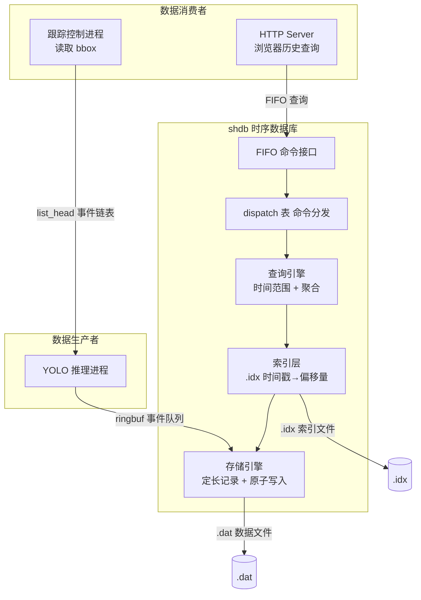
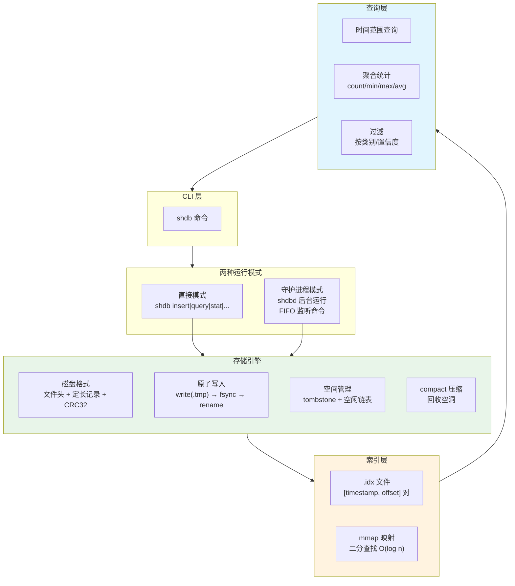
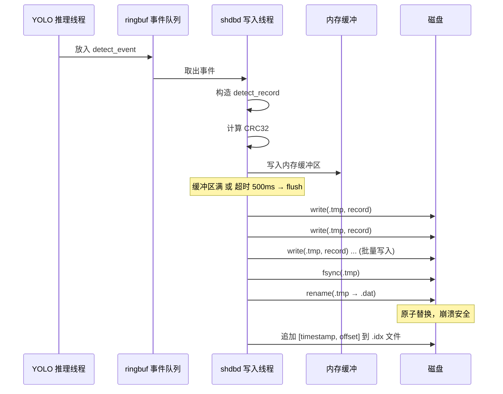
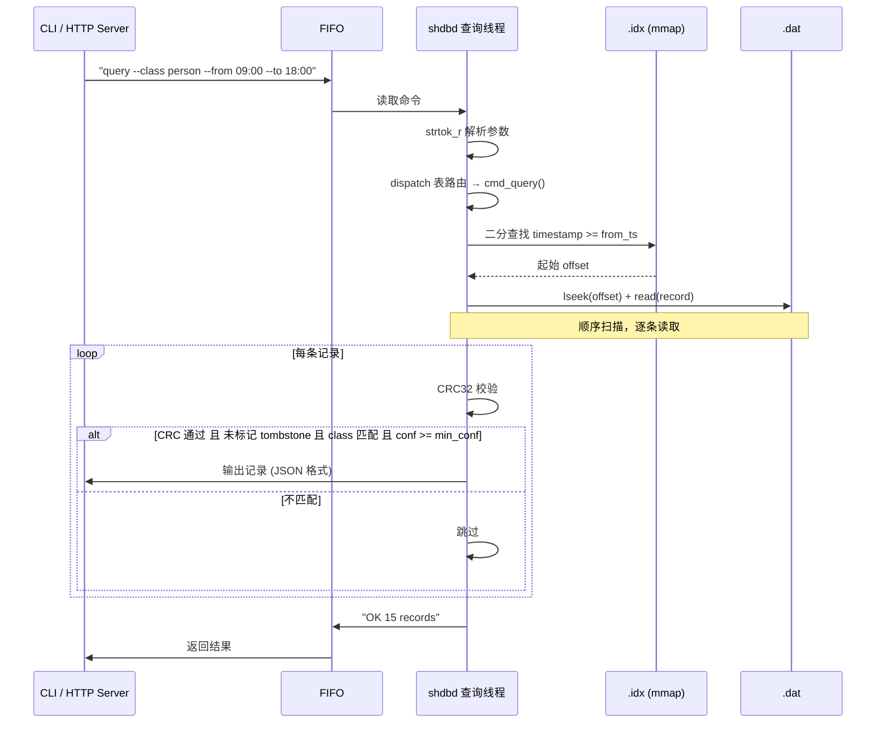
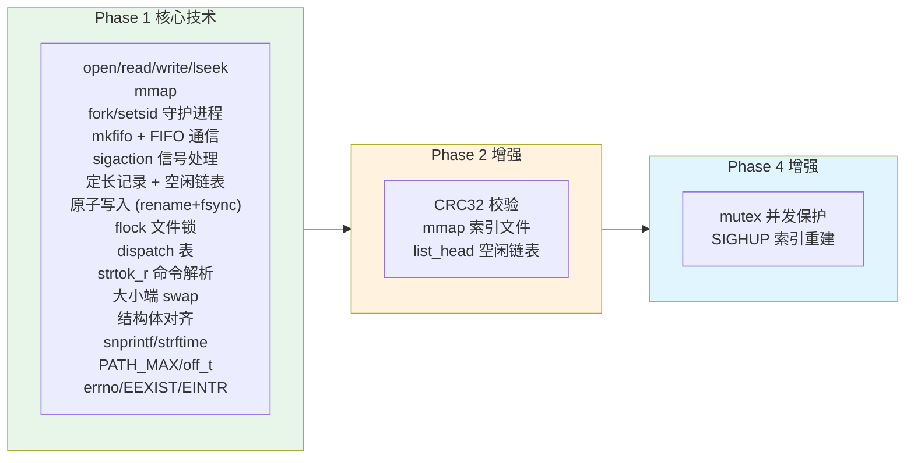
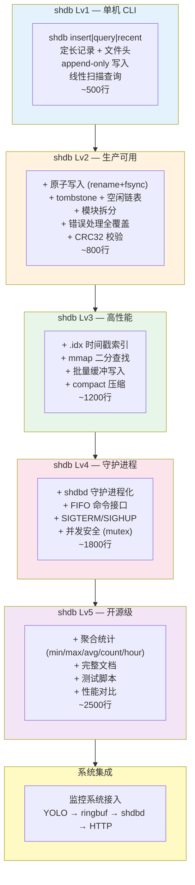

# shdb — 嵌入式时序数据库 完整技术地图

## 系统定位

shdb 是 Phase 1 的 Boss 项目，也是"远程监控系统"的数据心脏。

> **YOLO 检测到目标 → 结构化的"谁、什么时候、在哪、多确定" → shdb 存盘 → 随时按时间范围查回来**

不存原始帧，只存分析结果。本质上是一个**专为检测事件优化的时序存储引擎**。

---

## 一、在监控系统中的位置



---

## 二、shdb 独立架构

shdb 本身是一个完整的独立项目，不依赖监控系统的其他部分：



---

## 三、检测事件记录格式

### 磁盘布局

```
┌─────────────────────────────────────────────────────────┐
│                     .dat 文件格式                        │
├──────────┬──────────────────────────────────────────────┤
│ 文件头    │ magic(4B) | version(2B) | record_size(2B)   │
│ 16 bytes │ created_at(8B)                               │
├──────────┼──────────────────────────────────────────────┤
│ Record 0 │ timestamp(8B) | class(1B) | conf(4B)        │
│ 36 bytes │ bbox_x(2B) | bbox_y(2B) | bbox_w(2B)       │
│          │ bbox_h(2B) | thumb_off(4B) | thumb_sz(4B)  │
│          │ flags(1B) | reserved(2B) | crc32(4B)        │
├──────────┼──────────────────────────────────────────────┤
│ Record 1 │ （同上）                                      │
├──────────┼──────────────────────────────────────────────┤
│   ...    │                                              │
└──────────┴──────────────────────────────────────────────┘

flags: bit0 = tombstone(删除标记), bit1-7 = reserved
record_size = 36 (固定, 方便 O(1) 跳转)
```

### C 结构体

```c
struct detect_record {
    uint64_t timestamp;      // Unix 毫秒时间戳
    uint8_t  class_id;       // 目标类别 (0=person, 1=car, ...)
    float    confidence;     // 置信度 0.0-1.0
    uint16_t bbox_x, bbox_y; // 边界框左上角
    uint16_t bbox_w, bbox_h; // 边界框宽高
    uint32_t thumb_offset;   // 缩略图在 .thumb 文件中的偏移
    uint32_t thumb_size;     // 缩略图字节数
    uint8_t  flags;          // bit0=tombstone
    uint8_t  reserved[2];   // 对齐填充
    uint32_t crc32;          // CRC32 校验 (覆盖前 32 字节)
} __attribute__((packed));
```

---

## 四、数据写入链路



**关键设计决策**：
- 缓冲批量写入：不是每来一条事件就写一次磁盘，而是内存缓冲满 64 条或超时 500ms 才 flush。减少 fsync 次数，提升吞吐
- 原子替换：写 .tmp → fsync → rename，不会出现"写了一半崩溃导致 .dat 损坏"
- 索引追加：.idx 是 append-only，每次 flush 数据后追加一批索引条目。崩溃时最多丢最后一批未索引的记录，数据不丢

---

## 五、数据查询链路



---

## 六、各层功能与技术栈详解

### 存储引擎层

| 功能点 | 技术细节 | 来源 |
|--------|---------|:--:|
| 文件创建 | `open("data.shdb", O_RDWR\|O_CREAT, 0644)`, 检查 EEXIST | P1 文件IO |
| 文件头写入 | magic(0x53484442="SHDB") + version + record_size + created_at, 首次创建时写 | P1 fdb + bfile 大小端 |
| 定长记录定位 | `lseek(fd, HEADER_SIZE + id * RECORD_SIZE, SEEK_SET)` O(1) 跳转 | P1 fdb |
| 原子写入 | `write(.tmp) → fsync → rename`, 三步骤保证崩溃安全 | P1 fdb |
| 批量缓冲 | 内存 buffer[64], 满或超时 500ms flush, 减少 fsync 次数 | P1 fdb |
| 空闲链表 | tombstone 标记删除位, free_list 链表管理回收槽位 | P1 fdb |
| compact | 遍历全部记录 → 跳过 tombstone → 写到新 .tmp → rename, 回收空间 | P1 fdb |
| 文件锁 | `flock(fd, LOCK_EX)`, 防止多进程同时写 | P1 fdb/logd |
| CRC32 校验 | 写入时计算 CRC32 存尾, 读取时重新计算比对 | P2 |
| 数据损坏处理 | CRC 不匹配→跳过该记录→perror 报告→继续读下一条 | P2 |

### 索引层

| 功能点 | 技术细节 | 来源 |
|--------|---------|:--:|
| .idx 文件格式 | `[timestamp(8B), offset(4B)]` 对, 按时间戳升序排列, append-only | P1 fdb 延伸 |
| mmap 映射 | `mmap(NULL, size, PROT_READ, MAP_SHARED, idx_fd, 0)`, 零拷贝读取 | P1 fdb mmap |
| 二分查找 | `bsearch()` 或手写二分, 定位第一个 `timestamp >= target` 的条目 | — |
| 索引重建 | 启动时检测 .idx 不存在→全表扫描重建; SIGHUP 信号触发重建 | P1 fdb + logd sigaction |
| 索引一致性 | 崩溃后 .dat 可能比 .idx 多几条(最后一批 flush 的索引未写入)→启动时自动补索引条目 | P1 fdb |

### 查询层

| 功能点 | 技术细节 | 来源 |
|--------|---------|:--:|
| 命令 dispatch | `struct cmd { char *name; int (*handler)(args); }` 函数指针 dispatch 表 | P1 bfile dispatch表 |
| 时间范围查询 | 二分查找 .idx → 得到起始 offset → lseek + 顺序读 .dat → 过滤返回 | P1 fdb+bfile |
| 聚合统计 | 流式计算: 时间窗口内 count/min/max/avg/group_by_hour, 不存中间结果 | — |
| 按类过滤 | class_id 匹配, dispatch 表映射 class_id→类名字符串 | P1 bfile dispatch表 |
| 置信度过滤 | 查询结果二次过滤: `conf >= min_conf` | — |
| 最近 N 条 | 从 .idx 末尾倒推 N 条记录的 offset, 逆序读取 | P1 fdb |
| 删除记录 | 标记 tombstone 位 (bit0 of flags), 不物理删除 | P1 fdb |
| 命令解析 | `strtok_r()` 分割命令字符串, 兼容空格和引号参数 | P1 bfile strtok_r |
| 输出格式化 | `snprintf` 格式化为 JSON: `{"ts":...,"class":"person","conf":0.95,...}` | P1 logd snprintf |

### 进程架构（守护进程模式）

| 功能点 | 技术细节 | 来源 |
|--------|---------|:--:|
| 守护进程化 | fork×2 + setsid + chdir("/") + umask(0) + close(0/1/2) | P1 logd |
| FIFO 创建 | `mkfifo("/tmp/shdb.fifo", 0666)`, 处理 EEXIST | P1 logd |
| FIFO 监听 | `open(fifo, O_RDONLY\|O_NONBLOCK)` → while read 循环 | P1 logd |
| 断线重连 | 写端关闭→read 返回 EOF→close→重新 open→继续循环 | P1 logd |
| 信号处理 | SIGTERM→flush 缓冲区 + close fd + unlink fifo | P1 logd sigaction |
| | SIGHUP→全表扫描重建 .idx 索引 | P1 logd sigaction |
| 信号安全 | `volatile sig_atomic_t running = 1`, handler 只改标记 | P1 logd |
| 并发查询 | 主线程处理 FIFO 命令, 写入线程处理 ringbuf 事件, mutex 保护 .dat 写入 | P4 lock-lab |

---

## 七、命令接口

### 直接模式（CLI）

```bash
# 插入一条记录（手动测试用，生产环境由 YOLO 推理进程调用）
shdb insert --class person --conf 0.95 --bbox 120,80,200,300

# 时间范围查询
shdb query --from 2026-06-05T09:00:00 --to 2026-06-05T18:00:00

# 按类别过滤
shdb query --class person --from 09:00 --to 18:00 --min-conf 0.8

# 最近 N 条
shdb recent --count 100

# 聚合统计：每小时检测数量
shdb stat --from 09:00 --to 18:00 --agg count/hour

# 聚合统计：各类别平均置信度
shdb stat --from 00:00 --to 23:59 --agg avg/class

# 数据维护
shdb compact              # 回收 tombstone 空间
shdb info                 # 显示文件信息（总记录数/空间占用/运行时间）
shdb delete --id 12345    # 标记删除（tombstone）
```

### 守护进程模式（FIFO）

```bash
# 启动守护进程
shdbd &

# 通过 FIFO 发命令（HTTP Server 内部调用）
echo 'QUERY class=person from=09:00 to=18:00 min_conf=0.8' > /tmp/shdb.fifo
# 返回结果通过 FIFO 读回（或写到 /tmp/shdb.out）
```

---

## 八、跨 Phase 技术栈汇总



### Phase 1（核心，全部用上）

| 技术 | 在 shdb 中的角色 |
|------|-----------------|
| open/read/write/lseek | 数据文件和索引文件的 IO, O(1) 记录定位 |
| mmap | .idx 索引文件映射, 二分查找零拷贝 |
| fork×2 + setsid + chdir | shdbd 守护进程化 |
| mkfifo + open FIFO | 查询命令接口 |
| sigaction + sig_atomic_t | SIGTERM 优雅关闭, SIGHUP 重建索引 |
| 定长记录 | 每条 detect_record 36 字节, lseek O(1) 跳转 |
| 空闲链表 | tombstone 标记 + free_list 空间复用 |
| rename + fsync | 原子写入: write .tmp → fsync → rename |
| flock | 防止多个 shdbd 同时写数据文件 |
| dispatch 表 | query/stat/recent/delete/info/compact 命令分发 |
| strtok_r | FIFO 命令和 CLI 参数解析 |
| 大小端 swap | 文件头字段 (magic/version/record_size) |
| 结构体对齐 | detect_record `__attribute__((packed))` 固定布局 |
| snprintf | JSON 格式化输出 |
| errno | ENOENT/ENOSPC/EACCES/EEXIST/EINTR 全覆盖 |

### Phase 2（增强）

| 技术 | 在 shdb 中的角色 |
|------|-----------------|
| CRC32 | 每条记录尾部校验, 检测数据损坏 |
| mmap (深化) | .idx 文件的零拷贝二分查找 |
| list_head | 空闲链表从数组改为侵入式链表 |

### Phase 4（增强）

| 技术 | 在 shdb 中的角色 |
|------|-----------------|
| mutex | 写入线程和查询线程的并发保护 |
| SIGHUP 处理 | 运行中重建索引 |

---

## 九、边缘情况清单

### 文件与存储

- [ ] 磁盘满 → write 返回 ENOSPC → 拒绝写入, 返回错误给调用方
- [ ] 权限不足 → open 返回 EACCES → perror + 退出
- [ ] 数据文件不存在 → 首次启动自动创建 + 写文件头
- [ ] .idx 不存在 → 启动时全表扫描自动重建索引
- [ ] .dat 和 .idx 不一致 → 启动时检测, 自动补索引条目
- [ ] 文件被外部删除 → 后续 write 返回 EBADF, 重新 open
- [ ] 零字节文件 → 当作新文件, 写入文件头
- [ ] CRC 不匹配 → 跳过该记录, perror 报告, 继续读下一条
- [ ] 文件头 version 不匹配 → 拒绝打开, 提示版本号
- [ ] lseek 返回 -1 → 检查 errno, 返回错误

### 进程与信号

- [ ] FIFO 写端全部关闭 → read 返回 EOF → close → 重新 open, 循环
- [ ] 多次启动 shdbd → flock 检测已锁 → "shdbd already running" → 退出
- [ ] SIGTERM 到达时正在 write → handler 只设标记, 主循环检查标记后 flush + close
- [ ] SIGHUP 到达时正在查询 → 等当前查询完成再重建索引
- [ ] 信号中断慢系统调用 → while(ret==-1 && errno==EINTR) 重试

### 内存管理

- [ ] malloc 缓冲 buffer 返回 NULL → 降级为无缓冲逐条写入
- [ ] mmap 索引文件失败 → 降级为 read() 读索引
- [ ] 空闲链表为空（所有槽位被占用）→ 文件扩容（append 新记录到末尾）

---

## 十、生长路线



---

# 项目评测：shdb 嵌入式时序数据库

## 构想分析

**构想类型**：旗舰型（Phase 1 Boss，天花板 Lv5）
**预估难度**：★★★★★
**预估总代码量**：~1500–2500 行
**目标硬件**：IMX6ULL（开发运行）+ RK3588（生产运行，性能无压力）
**预估天花板**：Lv5

---

## 前置知识检查

| 需要 | 状态 | 在哪学 |
|------|:--:|------|
| open/read/write/lseek | ✅ 已会 | fdb |
| 定长记录 + 偏移计算 | ✅ 已会 | fdb |
| rename+fsync 原子写入 | ✅ 已会 | fdb |
| tombstone + 空闲链表 | ✅ 已会 | fdb |
| flock 文件锁 | ✅ 已会 | fdb/logd |
| fork×2+setsid 守护进程化 | ✅ 已会 | logd |
| mkfifo + open FIFO | ✅ 已会 | logd |
| sigaction + sig_atomic_t | ✅ 已会 | logd |
| dispatch 表 (函数指针数组) | ✅ 已会 | bfile |
| 大小端 swap | ✅ 已会 | bfile |
| strtok_r 字符串解析 | ✅ 已会 | bfile/shell |
| 结构体对齐 + packed | ✅ 已会 | bfile |
| CRC32 校验 | 🆕 | — (简单算法，现学) |
| 二分查找 | 🆕 | — (基础算法，现学) |
| 聚合流式计算 | 🆕 | — |
| mmap 映射文件 | 🆕 | P2 (Lv3 才用) |
| mutex 并发保护 | 🆕 | P4 (Lv4 才用) |

**判断**：核心依赖全部掌握。12 项已会 + 5 项新学但都是简单独立的知识点。**这是 Phase 1 能力最直接的项目——不需要等任何后续 Phase。**

---

## 关键风险

**风险 1：磁盘格式定错，后续全部重写**
这是 shdb 最大的风险点。文件头、记录布局、索引格式一旦定下来，后面改了就要写兼容代码或数据迁移工具。
→ **对策**：文件头带 version 字段（2 字节），从第一天就支持"检测版本不匹配→报错"。Lv1 只定义最核心字段（timestamp + class + confidence + bbox），预留 reserved 字段给后续扩展。

**风险 2：原子写入和索引一致性**
数据写入 .dat 和索引写入 .idx 不是同一个文件，崩溃时可能出现"数据已写但索引未更新"或反之。
→ **对策**：索引永远从数据重建（单一数据源原则）。启动时检测 .dat 和 .idx 的差异，自动补索引条目。索引丢了也能从 .dat 全表扫描重建。

**风险 3：批量缓冲的"最后一批丢失"**
缓冲 64 条才 flush，如果系统崩溃，缓冲池里未 flush 的记录会丢失。
→ **对策**：这是可接受的 tradeoff——时序数据允许少量丢失，换取写入性能。文档里明确说明"最多丢失最后 500ms 的数据"。如果需要零丢失（如金融场景），每一条都 fsync，shdb 提供 `--sync` 模式开关。

**风险 4：和 fdb 太像，面试官问"这跟 fdb 有什么区别"**
fdb 是键值数据库，shdb 是时序数据库。相似的是存储层的定长记录+原子写入（你复用你的方法论），不同的是：
- fdb 按 key 哈希查找 → shdb 按时间范围扫描
- fdb 索引是哈希表 → shdb 索引是时间戳有序数组 + 二分查找
- fdb 无聚合 → shdb 有 min/max/avg/count/hour
→ **对策**：note.md 里专门写一节"shdb vs fdb 设计对比"，面试时主动提。

---

## 分级实现路线图

| 等级 | 目标 | 核心新增 | 代码量 | 运行方式 |
|:--:|------|------|:--:|------|
| **Lv1 能跑** | 存进去、查出来 | 文件头 + 定长记录 + append写入 + 线性扫描查询 | ~500行 | CLI 直接模式 |
| **Lv2 扎实** | 崩溃也丢不了数据 | 原子写入 + tombstone + 空闲链表 + CRC + 错误处理全覆盖 | ~800行 | CLI 直接模式 |
| **Lv3 深入** | 查得快 | .idx 时间戳索引 + mmap 二分查找 + 批量缓冲 + compact | ~1200行 | CLI 直接模式 |
| **Lv4 飞升** | 后台服务 | shdbd 守护进程 + FIFO + 信号 + 并发安全 | ~1800行 | 守护进程模式 |
| **Lv5 开源级** | 能展示 | 聚合统计 + 文档 + 测试 + 性能对比 | ~2500行 | 双模式 |

---

### Lv1：能跑 — "能存能查就行"

**核心功能**：
- `shdb insert --class person --conf 0.95 --bbox 120,80,200,300` → 追加写入
- `shdb query --from 09:00 --to 18:00` → 线性扫描 .dat，逐条比对时间戳
- 文件头：magic + version + record_size + created_at
- 定长记录：36 字节，`lseek(offset)` O(1) 跳转
- append-only 写入（无原子保护，无索引）

**不包含**：原子写入、tombstone、空闲链表、索引、聚合、守护进程。故意的——先验证磁盘格式设计和基本读写逻辑。

**技术栈**：open/write/read/lseek + 结构体 + 大小端 swap + strtok_r + dispatch 表

**面试官**："哦，自己设计过时序数据存储格式。"

---

### Lv2：扎实 — "崩溃也不丢数据"

**新增功能**：
- 原子写入：write(.tmp) → fsync → rename
- tombstone 标记删除：`flags bit0`，不物理删除
- 空闲链表：记录删除后的槽位回收复用
- CRC32：写入计算 + 读取校验
- 所有 syscall 返回值检查：ENOSPC/EACCES/ENOENT/EINTR 全覆盖
- 模块拆分：`storage.c` / `index.c` / `query.c` / `cli.c`
- note.md：记录关键设计决策和踩坑

**新增技术栈**：原子写入三步骤 + tombstone + 空闲链表 + CRC32 + 模块拆分 + errno 全覆盖

**面试官**："基础是实的——原子写入、数据完整性校验、空间回收，思路清晰。"

---

### Lv3：深入 — "查得快"

**新增功能**：
- .idx 时间戳索引：`[timestamp(8B), offset(4B)]` 对，按时间升序，append-only
- mmap 映射 .idx，`bsearch()` 二分查找定位起始 offset
- 批量缓冲写入：内存 buffer[64]，满或超时 500ms flush
- compact：遍历 → 跳过 tombstone → 写入新 .tmp → rename
- 启动时自动检测并修复 .idx（不存在→重建 / 不一致→补条目）
- note.md 新增：shdb vs fdb 设计对比、为什么索引不存 mmap 而用独立文件

**新增技术栈**：时间戳索引设计 + mmap + 二分查找 + 批量缓冲 + compact

**面试官**："你比大多数应届生理解得深——知道时间戳索引为什么和 KV 索引设计不同，怎么做崩溃恢复。"

---

### Lv4：飞升 — "后台服务，随叫随到"

**新增功能**：
- shdbd 守护进程：fork×2 + setsid + chdir + umask + close fd
- FIFO 命令监听：`/tmp/shdb.fifo`，`open(O_RDONLY|O_NONBLOCK)` 循环读
- 信号处理：SIGTERM flush+close+unlink FIFO，SIGHUP 重建索引
- 断线重连：写端全关闭→EOF→close→重新 open→继续循环
- 并发安全：写入线程和 FIFO 查询线程共享数据，mutex 保护写入路径
- 启动检查：pid 文件 + flock 防止重复启动

**新增技术栈**：守护进程化 + FIFO 服务 + 信号处理 + mutex 并发

**面试官**："这个架构设计有意思——用户态数据库守护进程，FIFO 接口，能处理并发查询。你自己设计的？"

---

### Lv5：开源级 — "能直接写进简历核心位置"

**新增功能**：
- 聚合统计：`count / min / max / avg / group_by_hour / group_by_class`
- 完整文档：README（功能+构建+命令参考）+ note.md（设计决策+踩坑记录）
- 测试脚本：插入 10000 条模拟数据 → 查询验证正确性 → 聚合验证
- 性能对比：有索引 vs 无索引查询耗时（1万/10万/100万条）
- 可移植说明：POSIX 兼容、不依赖特定文件系统、32/64 位兼容
- 数据导出：`shdb export --from xxx --to xxx --format csv|json`

**新增技术栈**：流式聚合算法 + 自动化测试 + 性能 benchmark

**面试官**："独立设计实现嵌入式时序数据库，时间戳索引、原子写入、聚合查询、守护进程架构、完整文档——你简历上最硬的项目。和 RRDtool/Whisper 的设计对比？"

---

## 从构想走向实现的建议

1. **Lv1 先把格式定死。** 花一天时间反复推敲 `detect_record` 的字段：哪些必须？哪些预留？对齐怎么处理？格式定了就不要轻易改。建议在纸上画出字节布局再写代码。

2. **不要做成"通用时序数据库"。** 你的场景很明确——只存检测事件，字段就是那 11 个。不需要支持任意 metric、任意 tag、任意字段名。专注做好一件事，不要让接口膨胀。

3. **Lv1 用线性扫描，不要觉得丢人。** 1 万条记录线性扫描也就几毫秒。先把功能跑通，Lv3 再做索引——有索引的二分查找和线性扫描的耗时对比，正好写进 note.md 当设计决策素材。

4. **先把直接模式做到 Lv3，再切守护进程。** 直接模式下 debug 容易（printf 就行），守护进程模式下所有输出都到了 /dev/null。每级先跑稳直接模式，再封装守护进程。

5. **测试数据用手写脚本生成。** 写一个 `gen_test_data.sh`，生成 1000 条模拟检测记录放进 shdb。Lv1 验证查询正确性，Lv3 验证索引性能提升，Lv5 当作 benchmark 数据。

6. **考试完马上开工。** shdb 不需要等任何后续 Phase 的知识，你现在就能写 Lv1-Lv2。这是 Phase 1 最后一个项目，也是你 Phase 1 能力的最终验收。
