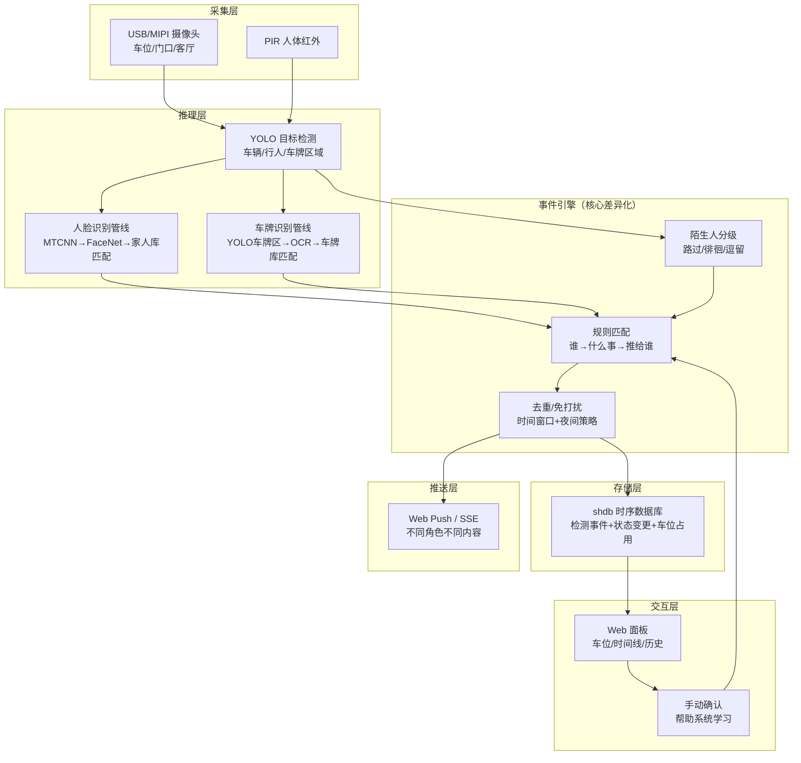
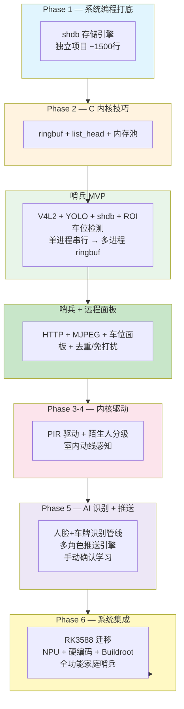

# 智能家庭哨兵系统 — 完整技术地图

## 产品一句话

> 一个架在窗台的摄像头盒子。同一幅画面，不同家人收到不同的消息——不是"打开看画面"，而是"告诉你是谁、发生了什么、要不要准备出门"。

## 系统概述



## 业务驱动的技术架构

### 一、数据模型：一条事件的完整生命周期

传统监控系统的事件是"检测到人"。哨兵系统的事件是"检测到人→识别身份→匹配规则→决定给谁发什么"。

```mermaid
flowchart LR
    subgraph 原始检测["摄像头看到"]
        B1["YOLO检测到车辆<br/>class: car<br/>bbox: [100,200,400,500]"]
        B2["YOLO检测到人<br/>class: person<br/>bbox: [150,100,350,600]"]
    end

    subgraph 身份识别["识别身份"]
        B1_P["车牌区域→OCR→<br/>"陕A·12345"→匹配自家车牌库<br/>→ 爸爸的车"]
        B2_P["人脸区域→FaceNet→<br/>embedding匹配→<br/>妈妈，置信度92%"]
        B2_X["人脸不匹配→陌生人"]
    end

    subgraph 空间语义["空间语义"]
        B1_S["车辆bbox命中车位A区域<br/>→ 车位A: 空→有车"]
        B2_S["行人bbox命中<br/>门口区域<br/>→ 门口有车"]
    end

    subgraph 事件输出["事件输出"]
        E1["事件: 爸爸的车停在车位A<br/>推送: 爸爸（告知停好）<br/>推送: 妈妈（车回来了）"]
        E2["事件: 妈妈回到门口<br/>推送: 爸爸（准备开饭）<br/>不推送: 孩子"]
    end

    B1 --> B1_P --> B1_S --> E1
    B2 --> B2_P --> B2_S --> E2
    B2 --> B2_X --> E2
```

### 二、核心技术栈对照

| 业务功能 | 技术实现 | 依赖 Phase | 新增 vs 原设计 |
|---------|---------|:--:|------|
| 车位空/满检测 | YOLO车辆检测 + 画面区域ROI划分 + 状态变更检测 | P1 | 新增ROI区域管理和状态变更 |
| 人脸识别 | MTCNN(检测) + FaceNet(特征提取) + 家人库cosine相似度匹配 | P5 | **全新** |
| 车牌识别 | YOLO(车牌区域) + PaddleOCR/LPRNet(字符) + 自家车牌库匹配 | P5 | **全新** |
| 多角色推送引擎 | 事件→规则匹配(谁→什么事)→角色过滤→Web Push | — | **全新** |
| 去重/免打扰 | 时间窗口: 同一人30min不重复推 + 夜间(23-7点)只推告警 | P1(shdb查询) | **全新** |
| 陌生人分级 | 路过(<10s)→徘徊(>30s)→逗留(>120s) + 靠近车辆→升级 | P1+P4 | **全新**（复用YOLO track + PIR） |
| 手动确认学习 | HTTP API接收用户反馈 → 调整此人置信度阈值 | — | **全新** |
| 室内动线感知 | PIR触发 + 人脸识别 → 推送"XX进了厨房" | P3+P4 | 原设计有PIR，加人脸+推送规则 |
| 天气/遮挡检测 | 画面亮度分析 + 连续全黑检测 | — | **全新** |
| V4L2采集管线 | mmap零拷贝 + ringbuf → YOLO推理 | P1+P2 | 不变 |
| shdb 存储引擎 | 定长记录 + 时间戳索引 + 原子写入 + mmap查询 | P1+P2 | 不变，新增事件类型枚举 |
| HTTP Server | epoll + MJPEG推流 + REST API + 静态面板 | P1+P5 | 不变，新增推送和确认端点 |
| PIR 内核驱动 | 字符设备 + 阻塞read + poll + 中断+workqueue | P3+P4 | 不变 |
| 舵机云台 | 自动跟踪(P4) → 哨兵模式主要用于门口/车位固定视角，手动控制保留 | P3+P4 | 缩减（自动跟踪优先级降低） |

### 三、事件类型枚举

```c
enum event_type {
    EV_PARKING_STATUS,   // 车位空/满状态变更 (car_in/car_out)
    EV_FAMILY_ARRIVE,    // 家人到达 (带人脸ID和身份)
    EV_FAMILY_LEAVE,     // 家人离开
    EV_STRANGER_PASS,    // 陌生人路过 (只记录)
    EV_STRANGER_LOITER,  // 陌生人徘徊 (推送提醒)
    EV_STRANGER_LINGER,  // 陌生人逗留 (推送告警)
    EV_CAMERA_BLOCKED,   // 摄像头被遮挡
    EV_CAMERA_SHIFT,     // 摄像头移位
    EV_WEATHER_BAD,      // 恶劣天气→识别暂停
    EV_USER_CONFIRM,     // 用户手动确认/纠正
};
```

### 四、shdb 记录结构变化

```c
// 原设计：通用的 detect_event
// 哨兵版本：区分身份信息的事件记录

struct sentinel_event {
    // 基础（原 detect_event 保留）
    uint64_t timestamp;      // 事件时间戳
    uint8_t  type;           // event_type 枚举
    uint8_t  class_id;       // YOLO class (car/person)
    float    confidence;     // YOLO 置信度 [0-1]
    uint16_t bbox[4];        // 边界框 (x,y,w,h)

    // 空间语义（新增）
    uint8_t  zone_id;        // 命中区域 (0=无, 1=车位A, 2=车位B, 3=门口, 4=客厅)
    uint8_t  zone_status;    // 区域状态变更 (0=空→有, 1=有→空, 2=不变)

    // 身份信息（新增，联合体节省空间）
    uint8_t  identity_type;  // 0=陌生人, 1=家人, 2=自家车, 3=未识别
    union {
        uint8_t family_id;   // 家人编号 (0-15)
        char plate[8];       // 车牌号 (如"陕A12345"含\0)
    } identity;

    // 推送决策（新增）
    uint8_t  push_level;     // 0=不推, 1=提醒, 2=告警
    uint8_t  push_targets;   // 位掩码: bit0=爸爸 bit1=妈妈 bit2=孩子
    uint8_t  confirmed;      // 0=系统判断, 1=用户确认正确, 2=用户纠正错误
};
```

### 五、去重/免打扰状态机

```mermaid
stateDiagram-v2
    [*] --> IDLE

    state IDLE {
        [*] --> 等事件
    }

    IDLE --> CHECK: 新事件到达

    state CHECK {
        检查类型: 路人 / 家人 / 车辆 / 异常
    }

    CHECK --> RATE_LIMIT: 路人 or 家人

    state RATE_LIMIT {
        查上次同人推送时间: 若距离上次<30min → 记录不推送
        若在夜间(23-7) and 非告警 → 记录不推送
    }

    RATE_LIMIT --> PUSH: 通过限频
    RATE_LIMIT --> DROP: 限频拦截

    CHECK --> PUSH: 车辆/异常(告警免限频)

    state PUSH {
        计算推送目标: 规则匹配 + 位掩码
        发送 Web Push / SSE
        写入 shdb + push_level
    }

    state DROP {
        写入 shdb (push_level=0)
        仅记录, 不推送
    }

    PUSH --> IDLE
    DROP --> IDLE
```

### 六、各等级功能对照

| 等级 | 业务功能 | 技术增量 | 代码量 | 面试叙事 |
|:--:|------|------|:--:|------|
| **Lv1** | 车位空/满检测 + CLI查询 | V4L2+YOLO+shdb+ROI管理 | ~800行 | "我在IMX6ULL上做了车位检测，画面分区+状态存储" |
| **Lv2** | +多进程管道+状态变更事件+原子写入 | ringbuf+守护进程化+CRC | ~1500行 | "多进程架构确保单帧不丢、事件不重复" |
| **Lv3** | +Web面板+去重+免打扰 | HTTP+MJPEG+时间窗口管理 | ~2500行 | "自己写的HTTP Server，车位面板实时刷新，去重逻辑不骚扰家人" |
| **Lv4** | +PIR驱动+陌生人分级+舵机 | PIR字符驱动+分级状态机 | ~3500行 | "内核态PIR驱动+用户态分级逻辑——知道什么时候该推、什么时候只记录" |
| **Lv5** | +人脸/车牌识别+多角色推送+全功能 | FaceNet+PaddleOCR+推送引擎+RK3588 | ~5000行 | "同一摄像头，不同家人收到不同信息。从IMX6ULL到RK3588，完整的嵌入式AI产品" |

### 七、技术取舍说明

**相比原远程监控设计，砍掉/缩减了**：

| 原设计 | 哨兵版 | 原因 |
|--------|--------|------|
| 自动跟踪（YOLO bbox→舵机修正） | 缩减为手动控制，自动跟踪可选 | 车位/门口是固定视角，不需要追着目标转 |
| MJPEG 15fps 高帧率推流 | 保留但不再核心 | 哨兵不鼓励"盯着看"，推送事件就够了 |
| ESP32 WiFi 透传 | Lv5直接上RK3588内置WiFi | IMX6ULL练手期可有线Ethernet |

**新增的**：

| 新增模块 | 代码量 | 关键技术点 |
|---------|:--:|------|
| 人脸识别管线 | ~400行 | MTCNN→FaceNet→cosine相似度→家人库匹配 |
| 车牌识别管线 | ~300行 | YOLO车牌ROI→OCR→车牌库匹配 |
| 事件引擎 | ~400行 | 规则配置+角色过滤+位掩码推送目标 |
| 去重/免打扰 | ~150行 | shdb时间窗口查询+夜间策略 |
| 陌生人分级 | ~200行 | 跟踪时长统计+距离/区域判别 |
| 摄像头健康监测 | ~100行 | 亮度分析+遮挡检测 |
| Web面板（车位+事件+确认） | ~300行 | 新增车位实时卡片、确认反馈控件 |

---

## 七、远程控制 API 设计

| 方法 | 路由 | 功能 | 说明 |
|------|------|------|------|
| GET | `/stream` | MJPEG 实时画面 | 可选，哨兵不鼓励盯着看 |
| GET | `/api/status` | 当前车位状态 | `[{"zone":"A","status":"有车"},...]` |
| GET | `/api/events` | 历史事件查询 | `?from=&to=&type=&zone=` |
| GET | `/api/stats` | 聚合统计 | `?agg=parking_hourly\|family_daily\|stranger_count` |
| GET | `/api/persons` | 家人库管理 | 查看已录入人员 |
| POST | `/api/persons` | 录入新家人 | 上传面部照片+身份+推送偏好 |
| POST | `/api/confirm` | 手动确认 | `?event_id=42&correct=true` 帮助系统学习 |
| POST | `/api/ptz` | 手动云台控制 | 可选，用于调视角 |
| POST | `/api/rules` | 推送规则配置 | 编辑"谁发生什么时推给谁" |

---

## 八、跨 Phase 技术栈汇总（与原设计一致的保留，新增标注★）

### Phase 1（全部用上）

| 技术 | 用到的地方 |
|------|-----------|
| open/read/write/lseek | V4L2 设备, shdb 记录, FIFO, 缩略图, PWM sysfs |
| mmap | V4L2 帧缓冲, shdb .idx 索引 |
| FIFO(mkfifo) | HTTP Server→shdbd 查询通道 |
| sigaction/sig_atomic_t | 各进程优雅退出 |
| 守护进程化 | shdbd 后台运行 |
| 定长记录+空闲链表 | shdb 存储引擎 |
| 原子写入(rename+fsync) | shdb 写入安全 |
| flock | shdbd 文件锁 |
| strtok_r | FIFO 命令解析, HTTP 参数解析 |
| dispatch 表 | shdbd 命令分发, YOLO class→事件类型映射, 推送规则路由 ★ |
| PATH_MAX/off_t | 文件路径, lseek 偏移量 |
| errno/EEXIST | mkfifo 已存在处理 |

### Phase 2

| 技术 | 用到的地方 |
|------|-----------|
| ringbuf 无锁队列 | 帧队列(采集→推理), 事件队列(推理→shdbd), 推送队列(事件引擎→HTTP) ★ |
| list_head 侵入式链表 | 事件链表, 多消费者并发遍历, 家人库链表 ★ |
| container_of | list_head 节点→事件/家人记录 ★ |
| 固定大小内存池 | 事件池 + 家人记录池(预分配16人) ★ |

### Phase 3-4（不变大部分）

| 技术 | 用到的地方 |
|------|-----------|
| cdev/file_operations | PIR 字符驱动 `/dev/pir` |
| 阻塞 read + poll | PIR 驱动等待队列 → 室内动线触发 |
| request_irq/workqueue | PIR 中断+消抖 |
| 设备树 | PIR/舵机节点 |
| spinlock/mutex | 驱动并发保护 |

### Phase 5

| 技术 | 用到的地方 |
|------|-----------|
| DMA 认知 | V4L2 帧缓冲 DMA 路径 |
| ftrace/perf | YOLO推理延迟追踪, 人脸识别热点 ★ |
| socket/HTTP | HTTP Server + REST API |
| **OpenCV/FaceNet推理** ★ | 人脸检测+特征提取 (C API或ncnn) |
| **PaddleOCR/LPRNet** ★ | 车牌字符识别 |

### Phase 6

| 技术 | 用到的地方 |
|------|-----------|
| Buildroot/Debian 构建 | 裁剪内核 + 应用打包 |
| RK3588 迁移 | NPU推理(RKNN) + 硬编码(MPP) + MIPI CSI ★ |
| 开机自启 | init.d/systemd 启动全部进程 |
| 完整文档 | README + note.md + 架构图 + 迁移指南 |

---

## 九、生长路线



---

## 项目评测总结

**构想类型**：旗舰型（跨 Phase 1-6，驱动 + AI + 全栈）

**与远程监控系统的本质区别**：

| | 远程监控系统 | 家庭哨兵 |
|------|------|------|
| 核心价值 | 技术展示（我会用这些技术） | 产品价值（这个东西对家人有用） |
| YOLO 的用法 | 通用检测 → 存下来 | 检测→识别身份→匹配规则→决定推送 |
| Web 面板 | 看画面+查历史 | 车位卡片+事件时间线+手动确认 |
| 数据流终点 | 浏览器显示 | 推送到指定的人 |
| 面试叙事 | "我做了个监控系统" | "同一个摄像头，不同家人收到不同信息" |

**最大风险**：人脸/车牌识别在嵌入式设备上的运行效率。Lv5 到 RK3588 才做识别，IMX6ULL 阶段用 YOLO 检测+区域划分已经能覆盖车位监测的核心场景。

**面试预期**：这个项目讲清楚"事件从摄像头到推送的完整链路"，加上"从 IMX6ULL 到 RK3588 的迁移"，以及"为什么选择做一个有产品感知的系统而不是又一个通用监控"——三层的叙事深度能跟面试官讨论技术选型和产品设计，而不只是被考知识点。
